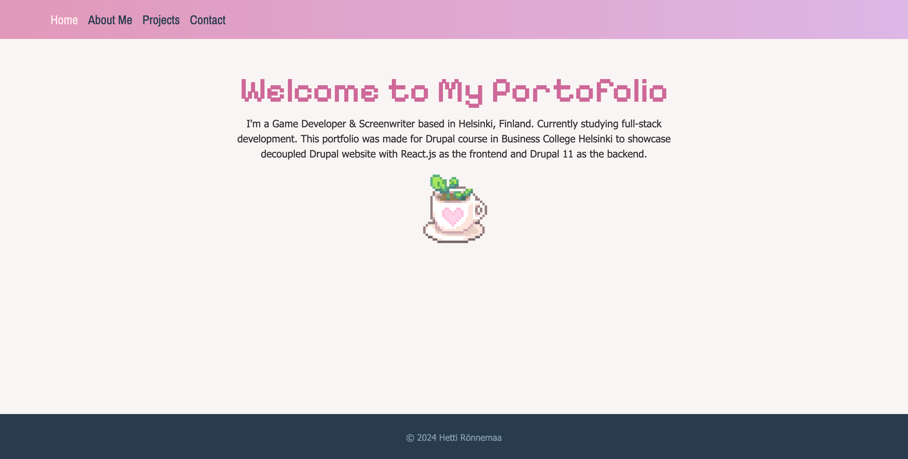

# Drupal + React Portfolio

This is a progressively decoupled full-stack web application that uses Drupal for the backend and React for the frontend. React theme works as the front end view fetching data via JSON:API module and Drupal works behind the scenes as the CMS.

## Screenshot



## Setup

- Install [Docker](https://www.docker.com/)
- Install [Lando](https://docs.lando.dev/)
- Clone the Repository

```bash
git clone https://github.com/hetti-r/Drupal-Portfolio.git
```

- Inside the project directory start lando

```bash
lando start
```

- Navigate to the React frontend directory

```bash
cd web/themes/custom/my-drupalreact-portfolio
npm install
npm run dev
```

- Import drupal configurations and database and clear cache

```bash
lando drush cim
lando db-import drupal11.2024-10-19-1729346522.sql.gz
lando drush cr
```
